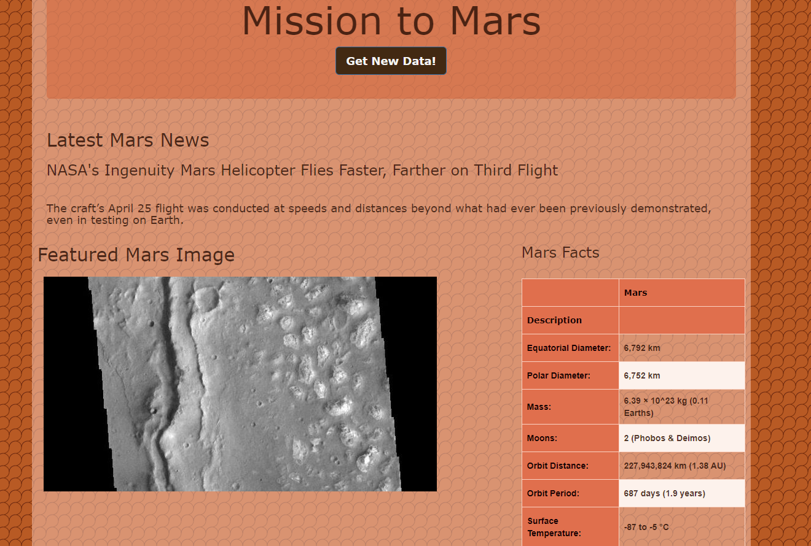

# Web-Scraping-Challenge
## Mission to Mars
 

### Steps
* Scrape the web using combination of WebDriver, BeautifulSoup, Splinter, and Pandas 
to create a scrape.py file
* Create an app.py file to connect to MongoDB to store the information scraped into a database
* Develop an HTML file to create the website that would host the files and display the information,  
including a button to get the most up to date information to populate on the site.

### Site address to view work can be found here:
## https://github.com/Brandy-knust/Web-Scraping-Challenge 

